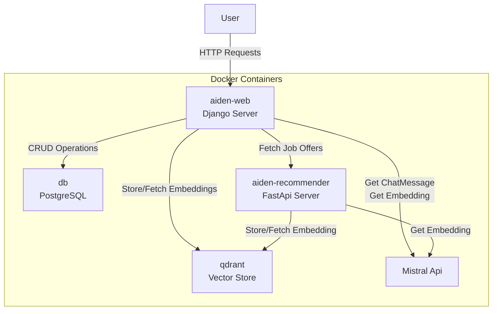

# Aiden App

Aiden (AI-Driven Employment Navigator) is a Django-based web application that uses the Mistral AI model for chat interactions. It also includes tools for CV editing and job scraping from Indeed, WelcomeToTheJungle and FranceTravail.

## Features

- Chat interface with the Mistral AI model
- CV editing tool
- Job scraping tool from Indeed, Wecolme to the Jungle and France Travail
- Cover letter generation and automated application form filling

### Profile Creation example

https://github.com/Anko59/aiden-job-finder/assets/25617029/d2dc5398-e12a-43de-a1df-e16440c7cd88

### Job search example

https://github.com/Anko59/aiden-job-finder/assets/25617029/6647b7f6-3b7d-4824-a495-1fcc443d2098

### Apply to job offer example

[Tab-1720711568300.webm](https://github.com/Anko59/aiden-job-finder/assets/25617029/d0ddc7aa-0b11-4d7c-96ed-20e108ca5040)

## Installation

You need the following API keys to run the app:
   - [Mistral API key](https://mistral.ai)
   - [France Travail Client credentials](https://france-travail.io)
   - [Zyte API key](https://zyte.com)

Modify your `.env` file with your API keys.

First build the app with
```bash
make build
```

Once set you can lauch the app with
```bash
make run
```
If you apply changes locally you need to rebuild the app

## Usage

After successfully installing and starting the Aiden App, you can interact with it through your web browser. Here are the steps:

1. Open your web browser and navigate to `aiden.dev.localhost`.
2. Create your brofile, by clicking the button on the left, and filling the form
3. Start a chat session.
4. You can now interact with the AI agent in the chat interface. The agent can perform various tasks based on your requests. For example, you can ask the agent to:
   - Search for job openings: "Search for data engineering jobs in Paris."
   - Edit your CV to fit a specific job description: "Edit my CV to fit the description of the position at Deezer."

Remember, the AI agent is designed to understand natural language, so feel free to phrase your requests in the way that feels most natural to you.


## Simplified Diagram of the Aiden App


## Future Features
Here are some planned future features for the Aiden App:
- Enhanced prompt engineering for better chat interactions
- User sessions to maintain context across multiple interactions
- Continuous Integration and Continuous Deployment (CI/CD) pipeline for automated testing and deployment
- Further assistance for applying to job offers
-

We are continuously working on improving the Aiden App and adding new features. Stay tuned for updates!
