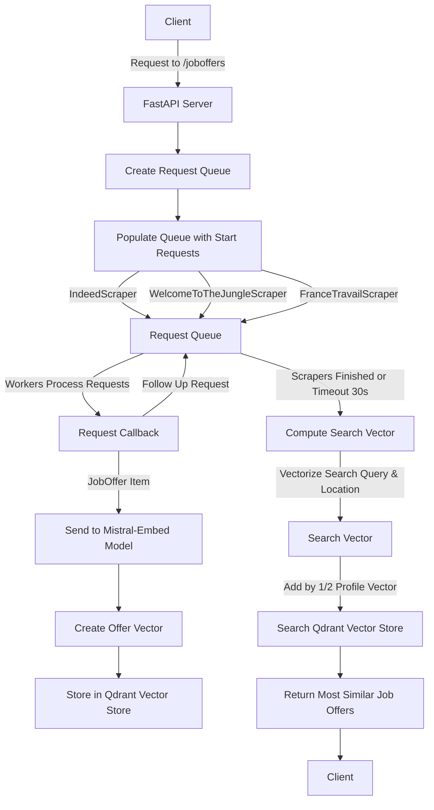

API that returns job recommendations based on user profile and scraped data

```mermaid
graph TD
    A[Client] -->|Request to /joboffers| B[FastAPI Server]
    B --> C[Create Request Queue]
    C --> D[Populate Queue with Start Requests]
    D -->|IndeedScraper| E[Request Queue]
    D -->|WelcomeToTheJungleScraper| E
    D -->|FranceTravailScraper| E
    E -->|Workers Process Requests| F[Request Callback]
    F -->|Follow Up Request| E
    F -->|JobOffer Item| G[Send to Mistral-Embed Model]
    G --> H[Create Offer Vector]
    H --> I[Store in Qdrant Vector Store]
    E -->|Scrapers Finished or Timeout 30s| J[Compute Search Vector]
    J -->|Vectorize Search Query & Location| K[Search Vector]
    K -->|Add by 1/2 Profile Vector| L[Search Qdrant Vector Store]
    L --> N[Return Most Similar Job Offers]
    N --> O[Client]

```
