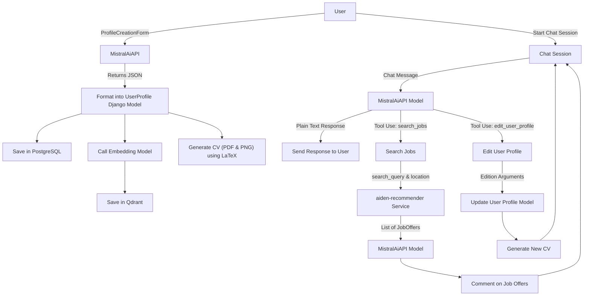

# Graph explaining the flow of the chatbot



# API Documentation

## Overview

This API provides endpoints for interacting with user profiles and a chat service. It allows you to:
- Start a chat session with a user profile
- Handle user questions via a streaming response
- Retrieve available user profiles
- Create a new user profile
- Get documents associated with a user profile

## Endpoints

### 1. Start Chat
**Endpoint:** `api/v2/start_chat`

**Method:** `POST`

**Description:** Start a chat session with a given profile.

#### Expected Input (JSON):
```json
{
  "first_name": "string",
  "last_name": "string"
}
```

#### Expected Output (JSON):
```json
{
  "role": "assistant",
  "content": "Hello! How can I assist you today?",
  "name": null,
  "tool_calls": null,
  "tool_call_id": null
}
```

### 2. Handle Question
**Endpoint:** `api/v2/question`

**Method:** `POST`

**Description:** Handle user question and respond via streaming HTTP.

#### Expected Input (JSON):
```json
{
  "question": "string",
}
```

#### Expected Output (JSON):
A stream of `ChatMessage` objects:
```json
{
  "role": "string",
  "content": "string or list of strings",
  "name": "optional string",
  "tool_calls": "optional list of tool call objects",
  "tool_call_id": "optional string"
}
```

### 3. Get Profiles
**Endpoint:** `api/v2/get_profiles`

**Method:** `GET`

**Description:** Retrive available user profiles

#### Expected Input (JSON):
None

#### Expected Output (JSON):
A list of profiles:

```json
[
  {
    "first_name": "string",
    "last_name": "string",
    "photo_url": "string"
  },
  ...
]
```

### 4. Create Profile
**Endpoint:** `api/v2/create_profile`

**Method:** `POST`

**Description:** Create a new user profile from submitted form data.

#### Expected Input (Multipart form data):
Fields required by UserCreationForm.

#### Expected Output (JSON):
```json
{
  "success": "Profile created successfully"
}
```

### 5. Get Documents
**Endpoint:** `api/v2/get_documents`

**Method:** `POST`

**Description:** Get documents associated with a given profile.

#### Expected Input (JSON):
```json
{
  "first_name": "string",
  "last_name": "string"
}
```

#### Expected Output (JSON):
A list of documents:

```json
[
  {
    "name": "string",
    "path": "string"
  },
]
```

### Error Responses
In case of an error, the API will return an error response with the following format:

```json
{
  "error": "string"
}
```

## Example

### Request

```bash
curl -X POST \
  http://localhost:8000/api/v2/start_chat \
  -H 'Content-Type: application/json' \
  -d '{
	"first_name": "string",
	"last_name": "string"
}'
```

### Response

```json
{
  "role": "assistant",
  "content": "Hello! How can I assist you today?",
  "name": null,
  "tool_calls": null,
  "tool_call_id": null
}
```

## Usage

### Starting a Chat Session:

- Send a POST request to /start_chat with the user's first and last name to initialize a chat session.
- Store the agent information in the session for subsequent interactions.

### Handling a Question:

- Send a POST request to /question with the user's question.
- The response will be a streaming HTTP response containing ChatMessage objects.

### Retrieving Profiles:

- Send a GET request to /get_profiles to retrieve a list of available profiles.

### Creating a Profile:
- Send a POST request to /create_profile with the necessary form data to create a new profile.
- The response will indicate whether the profile creation was successful.

### Getting Documents:

- Send a POST request to /get_documents with the user's first and last name to retrieve associated documents.
