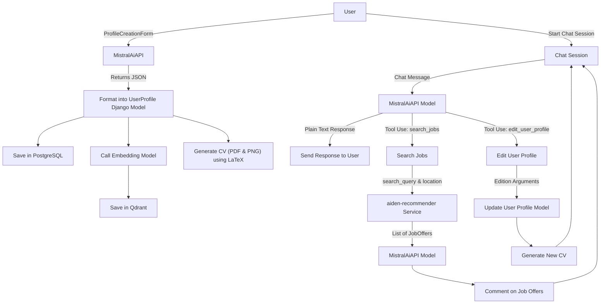

```mermaid
graph TD
    A[User] -->|ProfileCreationForm| B[MistralAiAPI]
    B -->|Returns JSON| D[Format into UserProfile Django Model]
    D --> E[Save in PostgreSQL]
    D --> F[Call Embedding Model]
    F --> H[Save in Qdrant]
    D --> I["Generate CV (PDF & PNG) using LaTeX"]
    A -->|Start Chat Session| J[Chat Session]
    J -->|Chat Message| K[MistralAiAPI Model]

    K -->|Plain Text Response| L[Send Response to User]

    K -->|Tool Use: search_jobs| M[Search Jobs]
    M -->|search_query & location| N[aiden-recommender Service]
    N -->|List of JobOffers| O[MistralAiAPI Model]
    O --> P[Comment on Job Offers]
    P --> J

    K -->|Tool Use: edit_user_profile| Q[Edit User Profile]
    Q -->|Edition Arguments| R[Update User Profile Model]
    R --> S[Generate New CV]
    S --> J

```
