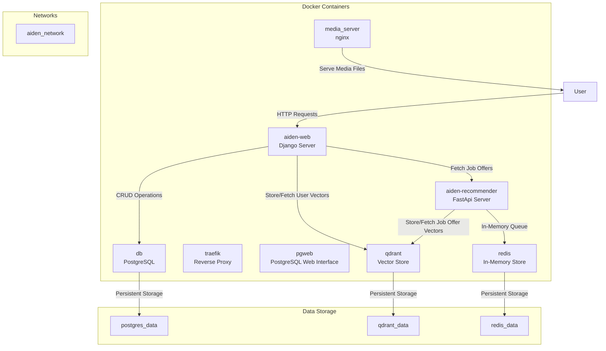

useful urls

- [interface](http://aiden.dev.localhost/)
- [pgweb on django db](http://pgweb.dev.localhost/)
- [qdrant vectore store](http://qdrant.dev.localhost/dashboard)
- [scraper api documentation](http://recommender.dev.localhost/docs)
- [traefik load balancer](http://localhost:8080/dashboard)

## Diagram of the overall architecture

